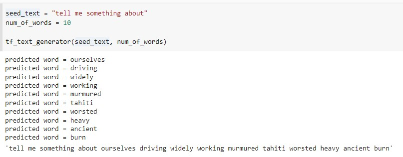
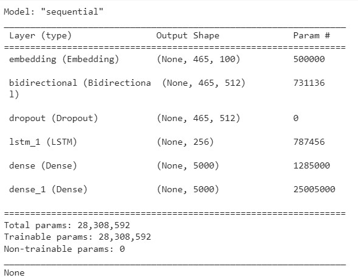
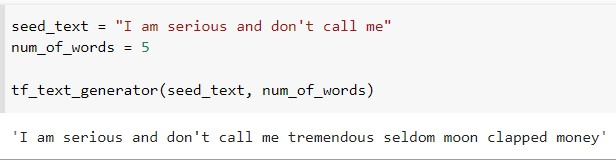
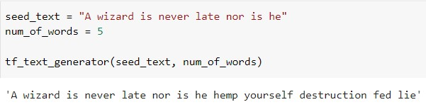

# A Text Generator on Moby Dick

A text generator trained on the novel "[*Moby Dick*](https://en.wikipedia.org/wiki/Moby-Dick)" together with a [Colab demo](https://colab.research.google.com/drive/1NSvtwV65Na51dsvUvHxMoGNyo6BXkEYp?usp=sharing) is presented here.

This project grows from my interest in how written English changes over time. I would like to see how an old-English speaker would continue a modern English phrase. This is simulated by deep learning.

An LSTM is trained to read the entire *Moby Dick* novel. In the earlier version, the novel was split into lines. Thus it could only be trained on a single chapter. The current version splits the text file by complete sentences, using [a code provided by Greenberg on stackoverflow](https://stackoverflow.com/a/31505798). This improves the quality and the quantity of the training set.

Secondly, the text generator output should make sense. In the standard online references on text generation, the function <code>numpy.argmax()</code> is applied to the predicted logits when predicting the next word. This causes two problems: the resulting text is gibberish, and often deterministic. To mitigate this, the presented text generator selects the next word by sampling from the predicted logits. As a result, the output text becomes dynamic and can be philosophical as well:

The sampling method was suggested by [Skarlit](https://github.com/Skarlit).

The model architecture is as follows

and is modified from the standard online references on LSTM on text generation. It takes around 6 hours to train one epoch under the standard runtime setting on Google Colab. A checkpoint trained for 4 epochs is also provided here.

## Sample Outputs

